# 声源定位
## 概要
本项目是基于pynq-z2板的声源定位系统。

## 实验环境
* OS: Ubuntu 20.04
* FPGA used: PYNQ-Z2
* GCC
* Python 3.7
* OpenCV
* Vivado 2019.1

## 程序说明
* SoundLocation文件夹中为声源定位核心算法程序，c程序
* Audio_direct文件夹中为PDM音频接收并转PCM音频的IP

# 技术文档
## 第一部分 技术概述
### 1.1设计目的
声源定位即确定一个声源在空间中的位置，其通过麦克风阵列接收语音信号并进行进行处理，从而确定和跟踪声音信号的位置。  
然而，基于FPGA的实现还很少见，作品期望通过FPGA的设计利用其并行计算的优点达到较为良好的实时性和准确性。 
### 1.2应用领域
 声源定位技术可用于噪声源定位、异音异响测试、语音增强、机器人声音定位、飞机噪声测试和电力设备监测等领域中。 
 例如汽车行驶过程中的异常啸叫声，要解决这些噪声问题，首先需要识别噪声并且定位噪声是从哪里发出来的，又什么设备或者部件造成，这就涉及到声源定位。
### 1.3 主要技术特点
1) 声源信息采集部分使用两个直线MEMS麦克风阵列组成的十字阵列，并集成到一块PCB板上，进行合理排布和走线，系统简单可靠的条件下同时保证了采集的精度。
2) 声源定位算法采用经典的GCC算法，能够较好地处理实际情况中不可避免的噪声问题，提高了声源定位的准确性。
3) 充分利用PYNQ PL+PS的强大系统架构，在PL端设计PDM采集IP进行数据采集，通过AXI总线传输，在PS端进行数据处理并完成声源定位算法
### 1.4 关键性能指标
1) 声源定位系统的实时性：如果声源移动位置，重新定位所需要的时间长短
2) 声源定位系统的准确性：声源实际位置和本装置计算的得到的位置之间的误差
3) 声源定位系统的稳定性：声源不动时，本装置在保证准确性的条件下维持的时间
### 1.5 主要创新点
1)	PYNQ声源定位：本作品采用PYNQ与声源定位相结合，是比较少见的。 
2)	十字贴片麦克风阵列：自主设计了麦克风十字阵列，并制成了PCB板，与PYNQ板上的输入引脚（电源、时钟等）相对应。
3)	快速GCC-PHAT算法：本作品采用了效果较好的GCC算法，通过加权后与传统TODA算法相比精度更高

## 第二部分 系统组成及功能说明
### 2.1 整体介绍 
本系统以PYNQ-Z2为主控板，连接摄像头用于拍摄声源定位实际场景，主控板连接声源采集模块的PCB板输入，并通过HDMI接口接到显示屏。 
其中，声源采集模块采集到的PDM数据输出到主控板,PYNQ-Z2进行数据接受并处理后输出到显示屏，将声源定位的结果可视化。
### 2.2 各模块介绍
#### 2.2.1 摄像机模块
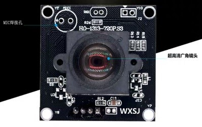
摄像头模块采用120度无畸变广角2.15mm 720p摄像头，具有USB免驱，逆光清晰，价格实惠等优点。 
该模块连接到主控板，数据通过HMDI输出到显示屏，主要用于声源定位实际场景的实时拍摄。
#### 2.2.2 显示模块

显示模块采用的是22寸HDMI显示器，画面清晰，显示细腻。通过HDMI接口与主控板相连，由PL端部署的Video模块控制视频的输出，连接方便简单。 
该模块用于展示声源的实际场景，并对声源定位的结果进行显示。
#### 2.2.3 声源数据采集模块
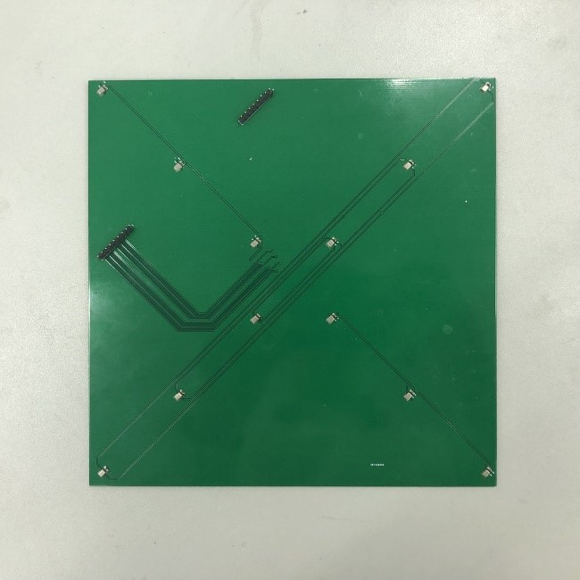
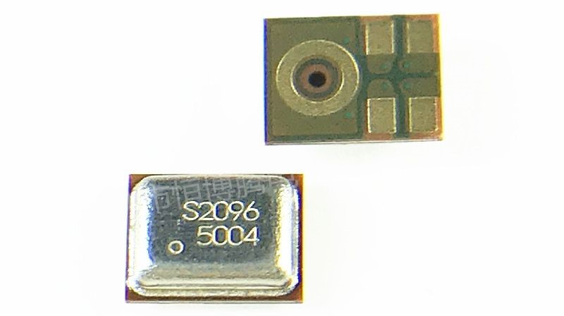
声源数据采集模块使用两组直线麦克风阵列组成十路十字阵列，麦克风采用MEMS麦克风SPH0641LU4H-1，具有很多优点：
1) 工艺一致性好，同一批次的MEMS麦克风生产在同一块硅片中，敏感度和频率响应一致性好
2) 简单易用，MEMS 麦克风通常是毫米数量级，内部集成了前置放大电路和ADC，因此在实际应用中不必考虑放大电路和ADC芯片的布局布线问题
3) 具有很强的抗干扰能力，不易受射频干扰和电磁干扰
4) 价格低
#### 2.2.4 主控板信息
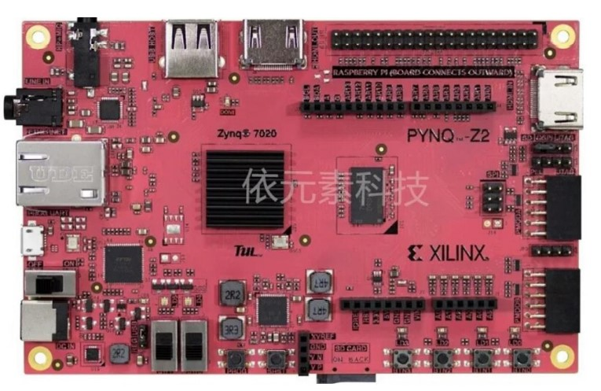
* 650MHz 双核 Cortex-A9 处理器，DDR3 内存控制器，带 8 个 DMA 通道和 4 个高性能 AXI3 从端口。
* 高带宽外设控制器：千兆以太网，USB 2.0，SDIO。
* 低带 宽外设控制器：SPI，UART，CAN，I2C。
* 可通过 JTAG，Quad-SPI 闪存和 MicroSD 卡进行编程，可编程逻辑等效于 Artix-7 
* FPGA：13000 逻辑片，每个片有 4 个 6 输入 LUT 和 8 个触发器，630 KB 快速 Block RAM，4 个时钟管理片，每个片都有 一个锁相环（PLL）和混合模式时钟管理器（MMCM），220 个 DSP 片，片上模数转换器（XADC）。
* 存储器：512MB DDR3，16 位总线@1050Mbps，16MB 四 SPI 闪存， MicroSD 插槽。
* 电源：由 USB 或 7V-15V 外部电源供电。

## 完成情况及性能参数
### 3.1 完成情况
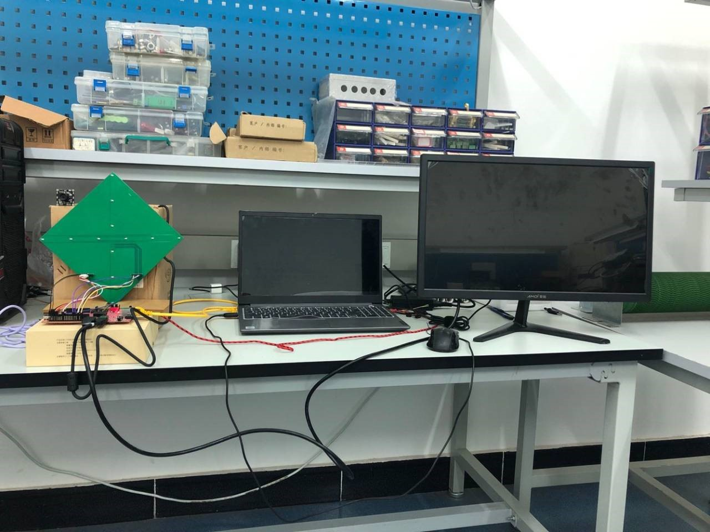
本系统由摄像头模块，麦克风阵列模块，显示模块，处理器模块共同构成。预计实现功能如下： 
1) 通过麦克风阵列捕获声源的声音，通过处理器进行处理；
2) 通过声源定位算法得到声源与麦克风的相对距离；
3) 通过摄像头与显示算法将结果定位在成像中。 
目前以上功能均已实现，各模块工作稳定，连接正常。

### 3.2 硬件设计
#### 3.2.1 硬件组成
系统的硬件组成如下图所示，首先两个输入端口（摄像头和麦克风阵列）同时捕获数据，由Audio Direct IP进行转码操作并传入处理器的寄存器中，此时调用声源定位算法进行处理，将处理结果标记在摄像头捕获的画面，将最终画面的HDMI信号输出到显示器上予以展示。
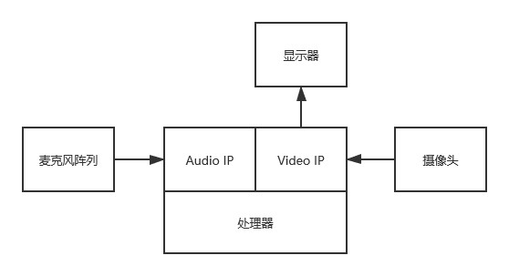
#### 3.2.2 FPGA利用
PL端主要加载了用于采集PDM数据的Audio IP与用于HDMI输出的Video IP。系统内部通过AXI总线连接。Audio模块接受麦克风阵列传递过来的PDM数据，并给麦克风阵列一个采样时钟，Video模块通过S_AXI_GP端口与PS端相连，用于接收视频的RGB数据，然后转换成DVI信号通过HDMI口输出。
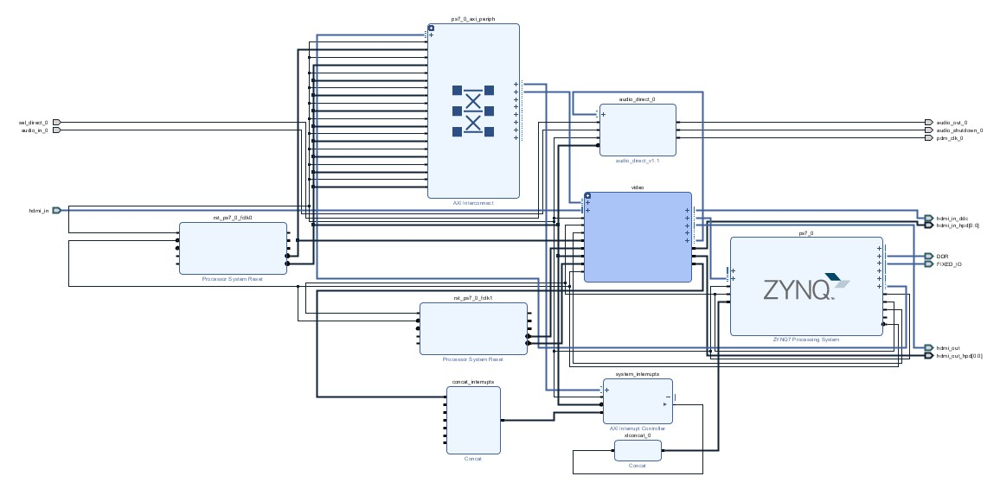
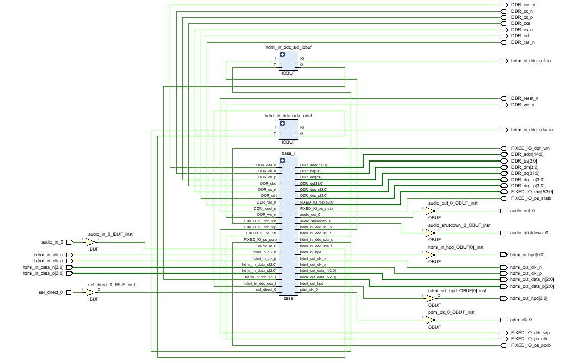
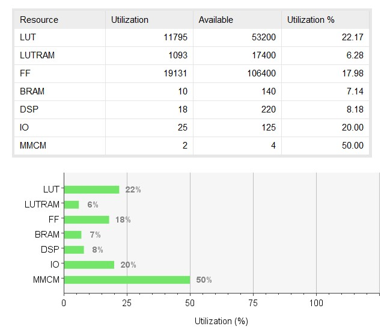
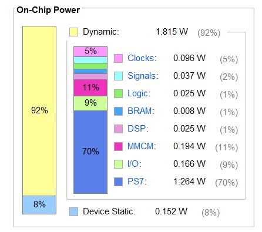
### 3.3 软件设计
#### 3.3.1 声源定位算法GCC-PHAT

广义互相关函数时延估计算法根据两个麦克风信号的互相关函数峰值来估计时延值。在声源定位系统中，麦克风阵列的每个阵元接收到的目标信号都来自于同一个声源。因此，各通道信号之间具有较强的相关性。理想情况下，通过计算每两路信号之间的相关函数，就可以确定两个麦克风观测信号之间的时延。

阵列中两个麦克风的接收信号为：
* $$ x_1(t) = \alpha_1s(t - \tau_1) + n_1(t) $$ 
* $$ x_2(t) = \alpha_2s(t - \tau_2) + n_2(t) $$
其中$ s(t) $为声源信号，$ n_1(t) $和$ n_2(t) $为环境噪声，$ \tau_1 $和$ \tau_2 $是信号从声源处传播到两个麦克风阵元的传播时间。相关参数可参见下图：
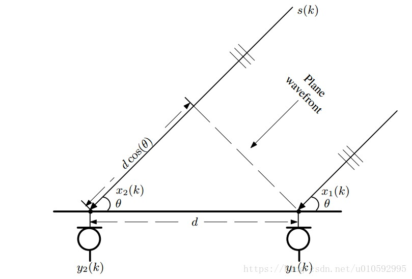
互相关算法经常被用来做时延估计，表示为：
代入信号模型，则有：
此时因为s(t)和n1(t)互不相关，上式可以简化为：
其中τ12=τ1-τ2，假设n1和n2是互不相关的高斯白噪声，则上式可以进一步简化为：
由相关函数的性质可知，当τ12=τ1-τ2时，Rx1x2(τ)取最大值，是两个麦克风之间的时延 
互相关函数和互功率谱的关系： 
在麦克风阵列信号处理实际模型中，由于存在混响和噪声影响，导致Rx1x2(τ)的峰值不明显，降低了时延估计的精度。为了锐化Rx1x2(τ)的峰值，可以根据信号和噪声的先验知识，在频域内对互功率谱进行加权，从而能抑制噪声和混响干扰。最后进行傅里叶逆变换，得到广义互相关函数Rx1x2(τ)： 
其中φ12(w)表示频域加权函数。广义互相关时延估计算法框图如下：
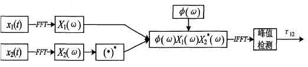

#### 3.3.2 基于时延估计的定位运算
通过时延估计，可以得到信号入射麦克风的角度，但是一个线性麦克风阵列只能够估计二维平面内的声音信号入射方向，于是我们布置了十字形麦克风阵列，利用两个线性麦克风阵列可以得到空间内声源的入射角。如图，得到球坐标系的两个角度后，只要在x轴上固定距离设置一个平面就可以对平面上的声源进行定位。 
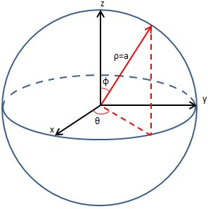

### 3.4 实现效果
如图所示，对于静止声源（图中手机作为声源），能够达到较为理想的定位效果。
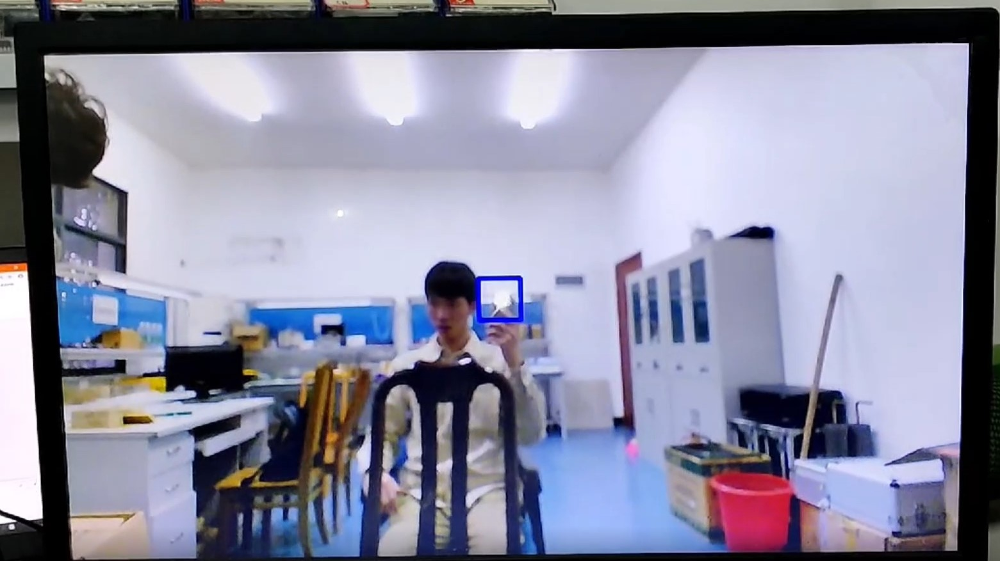

## 第四部分  总结

### 4.1 可扩展之处
1) 可以进一步将调用的C程序封装成IP，利用加速器对FFT进行加速，提升快速性
2) 可以增加阵列，适用于不同距离的声源定位
3) 可以通过外接的SD卡，将转化的PCM音频存储，与摄像头数据相对应，便于后期验证
4) 更换硬件设备，增强画面的清晰度和稳定性

### 4.2 4.2	心得体会
通过本次竞赛，我们更加深入地了解了FPGA地性能以及使用方法。与课堂上布置的作业不同，真正设计一个有创新意义的IP和系统是极其困难的。在这过程中，我们夜以继日进行算法的仿真，代码的编写，工程的综合，BUG的调试，对FPGA的理解和掌握有了质一般的飞跃。这样一个大工程，只有一个人是无法完成的，需要团队成员之间的相互配合。感谢全国组委会给予我们宝贵的机会来锻炼自己，这必是我们成长路上浓重的一笔！

## 第五部分  参考文献
* [1] 李俊杰, 何友, 宋杰. 基于FPGA的实时声源定位[J]. 微型机与应用, 2009. 
* [2] 任勇. 基于麦克风阵列的声源定位算法的FPGA实现[D]. 西安电子科技大学 
* [3] 何頔. 基于FPGA的声源定位系统软硬件设计[D]. 
* [4] 夏明秋. 基于FPGA声源定位的数据同步采集与算法实现[D]. 2016. 
* [5] 岳蒂, 栾峰, 佘黎煌,等. 基于STM32和FPGA的声源成像系统设计[J]. 实验室研究与探索, 2018, 37(07):133-137. 
* [6] https://www.cnblogs.com/ytxwzqin/p/9004603.html 

